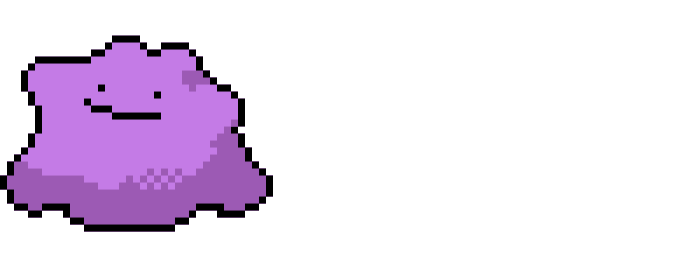

<p align="center">
  <picture>
    <source media="(prefers-color-scheme: dark)" srcset="docs/source/_static/logo/ditto-dark-mode.svg">
    <source media="(prefers-color-scheme: light)" srcset="docs/source/_static/logo/ditto-light-mode.svg">
    
  </picture>
</p>

<p align="center">
<span style="color: #D8D8D8;"><strong>Developer Integrated Toolkit for Technical Optimization (DITTO)</strong></span>
  
</p>

<p align="center">
  <a href="https://github.com/nolmacdonald/ditto/actions/workflows/ci.yml">
    
  </a>
  <a href="https://github.com/nolmacdonald/ditto/actions/workflows/docs.yml">
    
  </a>
  <a href="https://github.com/nolmacdonald/ditto">
    =3.12"
    />
  </a>
  
  
  
</p>


<p align="center">
  <a href="https://nolmacdonald.github.io/ditto"> Documentation</a> |
  <a href="https://github.com/nolmacdonald/ditto/issues"> Report Bug</a> |
  <a href="https://github.com/nolmacdonald/ditto/issues"> Request Feature</a>
</p>

---

**ditto** is a batteries-included Python package template for scientific computing projects.
Stop copying boilerplate between repos — clone ditto and get straight to the science.

## Features

<p align="center">

| Feature              | Tooling                                                                                             |
|----------------------|-----------------------------------------------------------------------------------------------------|
| Build backend        | [uv_build](https://docs.astral.sh/uv/concepts/build-backend/)                                       |
| Formatting & linting | [ruff](https://docs.astral.sh/ruff/)                                                                |
| Type checking        | [ty](https://github.com/astral-sh/ty)                                                               |
| Env & dependencies   | [uv](https://docs.astral.sh/uv/) (universal `uv.lock`, PEP 735 groups)                              |
| Testing & coverage   | [pytest](https://docs.pytest.org/) + pytest-cov                                                     |
| Units                | [pint](https://pint.readthedocs.io/)                                                                |
| Documentation        | [Sphinx](https://www.sphinx-doc.org/) + [PyData theme](https://pydata-sphinx-theme.readthedocs.io/) |
| Python support       | 3.12, 3.13, 3.14 (tested in CI)                                                                     |
| CI/CD                | [GitHub Actions](https://github.com/features/actions)                                               |

</p>

## Use This Template

Click **[Use this template](https://github.com/nolmacdonald/ditto/generate)** on GitHub,
clone your new repository, then rename the package:

```bash
python scripts/rename_project.py my_package --owner my-github-user --repo my-repo
```

The script renames `src/ditto/` and rewrites every reference to `ditto` in
`pyproject.toml`, the docs, the workflows, and the issue templates. It only
depends on the standard library, so no environment is needed to run it. Pass
`--dry-run` first to preview the changes, and see [TEMPLATE.md](TEMPLATE.md) for
the full checklist of what to do afterwards.

## Quick Start

```bash
git clone https://github.com/nolmacdonald/ditto.git
cd ditto
uv sync
uv run pytest
```

`uv sync` provisions the interpreter pinned in `.python-version`, creates
`.venv`, and installs the project plus the `dev` dependency group from
`uv.lock`. No `pip`, `venv`, or `python` on `PATH` required.

## Installation

```bash
uv add ditto      # into a project
uv pip install ditto
```

## Development

```bash
# Sync the environment (project + dev group)
uv sync

# Include the docs group as well
uv sync --group docs

# Format and lint
uv run ruff format .
uv run ruff check .

# Type check
uv run ty check src/

# Run tests
uv run pytest

# Build the sdist and wheel with the uv build backend
uv build
```

## Documentation

```bash
uv sync --group docs
uv run sphinx-build -b html docs/source docs/_build/html
```

Full documentation is available at **[nolmacdonald.github.io/ditto](https://nolmacdonald.github.io/ditto)**.

## Contributing

Contributions are welcome! See [CONTRIBUTING.md](CONTRIBUTING.md) for guidelines.
